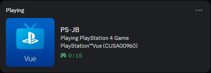
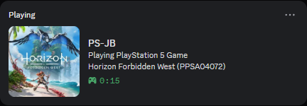
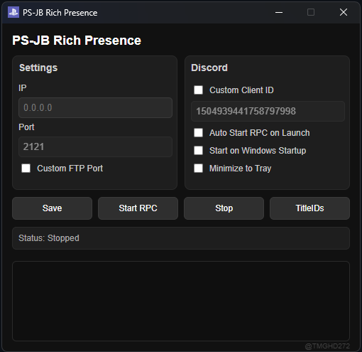
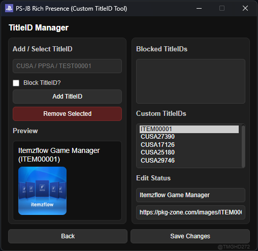

  

<h1 align="center">PS-JB Rich Presence</h1>

<h3 align="center">A payload-less, FTP-based Discord Rich Presence status for jailbroken PS4 & PS5!</h3>
<h4 align="center">(A great way to flex your friends that you're playing on a jailbroken PS4/PS5!)</h4>

---

## Preview

  
  
  

  
  

---

## How it works

* It connects to the PS console using the FTP server and uses the directory to detect the opened game `/mnt/sandbox/CUSAxxxxx` or `/mnt/sandbox/PPSAxxxxx`.
* Then it takes that obtained CUSA/PPSA title ID to orbispatches.com or prosperopatches.com, then takes the game name or icon and uploads that data to the Discord user's status.
* This app supports auto-starting the rich presence at launch, being able to start the app after Windows boot, and supports minimize-to-tray functionality.

---

## Installation and Setup

* Download the [release](https://github.com/tmghd272/ps-jb-rich-presence/releases/tag/ps-jb-rich-presence_release) to get started. Simply run the exe and type in your PS4/PS5 FTP `0.0.0.0` IP. Click save and Start RPC!
* To have it fully automatically run in the background without having to always open it manually:
* Simply toggle `Auto Start RPC on Launch`, `Start on Windows Startup`, and `Minimize to Tray` depending on your choice.

---

## Misc

* Only supports official PlayStation games & apps, ~~no support for homebrew apps~~ you can now add your own TitleID and customize it's game name/icon. CUSA/PPSA TitleID are also customizable.
* And yes, this app is heavily open-sourced. You can use your own [Discord Application ID](https://discord.com/developers/home) if you want to.

---

## Disclaimer

This project is for cosmetic purposes only.

Created with JavaScript / ElectronJS
